# Konsole Remote Copy


**Konsole Remote Copy** is a lightweight utility for KDE Konsole that lets you **copy file contents from a remote (SSH) or local machine directly to your local clipboard**.

No more `cat`, no more mouse selection, no more remembering obscure clipboard commands.


---

## ✨ Features

📋 Copy files directly to your local clipboard\
🔐 Works seamlessly over SSH\
⚡ Triggered via a keyboard shortcut\
🧠 Uses your normal shell (tab completion supported)\
🧩 Zero dependencies on the remote server

---

## 🚀 How It Works

1. Trigger via keyboard shortcut  
2. Script detects your active Konsole session  
3. Injects a command into the terminal  
4. Prompt appears:
```bash
File to copy:
```
5. Select file (tab completion works) and press Enter  
6. File contents are copied to your **local clipboard**

---

## 🔬 Under the Hood

This tool leverages the **OSC 52** terminal protocol:

- File contents are encoded with `base64` on the remote machine  
- Sent via a terminal escape sequence  
- Konsole receives it and updates your clipboard  

👉 No software required on the remote host

---

## 📦 Installation

Run on your local KDE machine:

```bash
./install.sh
```

This will:

- Check dependencies
- Install the script to ~/.local/bin/

## ⚙️ Konsole Configuration

Ensure clipboard access is enabled:

1. Open Konsole
2. Go to Settings > Edit Current Profile
3. Navigate to Mouse > Miscellaneous
4. Tick > Allow terminal applications to handle clicks and drags

## ⌨️ Keyboard Shortcut Setup

1. Open System Settings → Keyboard → Shortcuts
2. Click + Add New → Command or Script
3. Name it (e.g. Remote Copy)
4. Set command to:
```bash
/home/YOUR_USERNAME/.local/bin/konsole-remote-copy.sh
```
5. Click Input to assign a shortcut key such as Meta+C

## 📋 Requirements

**Local Machine**

KDE Plasma 6
qdbus6 (qt6-tools)
libnotify (optional)

**Remote Machine (if SSH)**

base64 (standard on most Linux systems)

## 🛠 Troubleshooting

**Nothing happening?**

Ensure qdbus6 is installed
Verify shortcut uses the correct absolute path

**Copy fails?**

Ensure Konsole allows clipboard access from terminal apps

**Debugging**

tail -f /var/log/syslog
Or add your own debug logging

## 💡 Why Bother?
Faster than copy/paste over SSH
Cleaner than dumping file contents to terminal
No need for scp, xclip, or custom tooling
Works anywhere Konsole + SSH works
Good for people who don't want to install extra software

## 📜 License

MIT

## 🙌 Contributions

Always open to new ideas and improvements to Konsole. 
